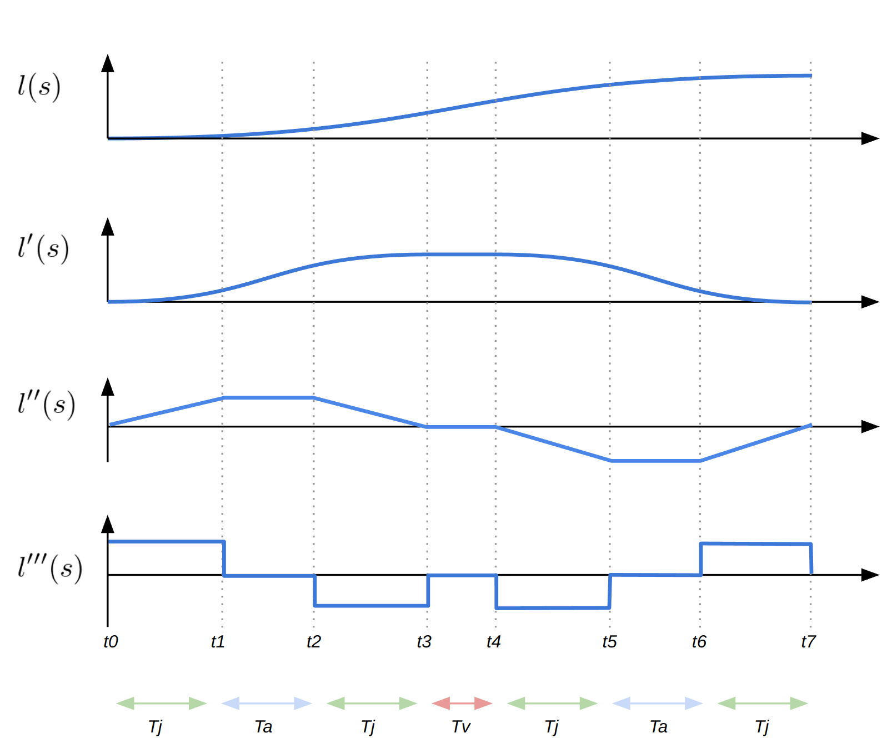

# Autoware Trajectory

This package provides classes to manage/manipulate Trajectory.

## Overview

### Interpolators

The interpolator class interpolates given `bases` and `values`. Following interpolators are implemented.

- Linear
- AkimaSpline
- CubicSpline
- NearestNeighbor
- Stairstep


[View in Drawio]({{ drawio("/common/autoware_trajectory/images/overview/interpolators.drawio.svg") }})

The builder internally executes interpolation and return the result in the form of `expected<T, E>`. If successful, it contains the interpolator object.

```cpp title="./examples/example_readme.cpp:53:68"
--8<--
common/autoware_trajectory/examples/example_readme.cpp:53:68
--8<--
```

Otherwise it contains the error object representing the failure reason. In the below snippet, cubic spline interpolation fails because the number of input points is 3, which is below the `minimum_required_points() = 4` of `CubicSpline`.

```cpp title="./examples/example_readme.cpp:109:119"
--8<--
common/autoware_trajectory/examples/example_readme.cpp:109:119
--8<--
```

In such cases the result `expected` object contains `InterpolationFailure` type with an error message like **"base size 3 is less than minimum required 4"**.

### Trajectory class

The _Trajectory_ class provides mathematical continuous representation and object oriented interface for discrete array of following point types

- [x] `geometry_msgs::Point`
- [x] `geometry_msgs::Pose`
- [x] `autoware_planning_msgs::PathPoint`
- [x] `autoware_planning_msgs::PathPointWithLaneId`
- [x] `autoware_planning_msgs::TrajectoryPoint`
- [ ] `lanelet::ConstPoint3d`

by interpolating the given _underlying_ points. Once built, arbitrary point on the curve is continuously parametrized by a single `s` coordinate.

```cpp title="./examples/example_readme.cpp:547:562"
--8<--
common/autoware_trajectory/examples/example_readme.cpp:547:562
--8<--
```


[View in Drawio]({{ drawio("/common/autoware_trajectory/images/overview/trajectory.drawio.svg") }})

## Nomenclature

This section introduces strict definition of several words used in this package to clarify the description of API and help the developers understand and grasp the geometric meaning of algorithms.

| Word                              | Meaning                                                                                                                                                                                                                                                                                                                                                                          | Illustration                                                                                                                                                                                                                                                                                                                                                                                                                                                                                                                                                                                         |
| --------------------------------- | -------------------------------------------------------------------------------------------------------------------------------------------------------------------------------------------------------------------------------------------------------------------------------------------------------------------------------------------------------------------------------- | ---------------------------------------------------------------------------------------------------------------------------------------------------------------------------------------------------------------------------------------------------------------------------------------------------------------------------------------------------------------------------------------------------------------------------------------------------------------------------------------------------------------------------------------------------------------------------------------------------- |
| `curve`                           | `curve` is an oriented bounded curve denoted as `(x(s), y(s), z(s))` with additional properties, parameterized by `s` (`s = 0` at the start).                                                                                                                                                                                                                                    | <br>[View in Drawio]({{ drawio("/common/autoware_trajectory/images/nomenclature/curve.drawio.svg") }})<br>There are 5 `underlying` points<br>$\mathrm{P0} = (0, 0, 0)$<br>$\mathrm{P1} = (1/ \sqrt{2}, 1/ \sqrt{2}, 0)$<br>$\mathrm{P2} = (1/ \sqrt{2}, 1+1/ \sqrt{2}, 0)$<br>$\mathrm{P3} = (2/ \sqrt{2}, 1+2/ \sqrt{2}, 0)$<br>$\mathrm{P4} = (2/ \sqrt{2} + 1/ \sqrt{6}, 1+2/ \sqrt{2} + 1 / \sqrt{3}, 1 / \sqrt{2})$<br>and the `arc length` between each interval is $1, 2, 1, 1$ respectively, so $\mathrm{start} = 0$ and $\mathrm{end} = 5$. |
| `underlying`                      | `underlying` points of a curve refers to the list of 3D points from which the curve was interpolated.                                                                                                                                                                                                                                                                            |                                                                                                                                                                                                                                                                                                                                                                                                                                                                                                                                                                                                      |
| `arc length`[m]                   | `arc length` denotes the approximate **3D** length of of a curve and is computed based on the discrete `underlying` points.                                                                                                                                                                                                                                                      |                                                                                                                                                                                                                                                                                                                                                                                                                                                                                                                                                                                                      |
| `s`[m]                            | `s` denotes the **3D** `arc length` coordinate starting from the base point (mostly the start point) of the curve and a point is identified by `trajectory(s)`.<br>Due to this definition, the actual _curve length_ and `arc length` have subtle difference as illustrated.                                                                                                     | <br>[View in Drawio]({{ drawio("/common/autoware_trajectory/images/nomenclature/approximation.drawio.svg") }})<br>The point for $s = 0.5$ is the purple dot, but the _curve length_ from $\mathrm{P0}$ to this point does not equal to $0.5$.<br>The exact _curve length_ is $\int \sqrt{(\frac{dx}{dt})^2 + (\frac{dy}{dt})^2 + (\frac{dz}{dt})^2} dt$, which cannot be obtained in an analytical closed form.                                                                                                                      |
| `curvature`                       | `curvature` is computed **using only X-Y 2D coordinate**. This is based on the normal and natural assumption that _roads are flat_. Mathematically, it asserts that [Gaussian curvature](https://en.wikipedia.org/wiki/Gaussian_curvature) of road is uniformly 0.<br>The sign of curvature is positive if the center of turning circle is on the left side, otherwise negative. | <br>[View in Drawio]({{ drawio("/common/autoware_trajectory/images/nomenclature/curvature.drawio.svg") }})                                                                                                                                                                                                                                                                                                                                                                                                                                   |
| `k_points_minimum_dist_threshold` | This is a constant threshold that is used to check if two points or values are same and to avoid zero division.                                                                                                                                                                                                                                                                  |                                                                                                                                                                                                                                                                                                                                                                                                                                                                                                                                                                                                      |
| `almost-same`                     | The pair of two points $P_{1}$ and $P_{2}$, or the pair of two base values $s_{1}$ and $s_{2}$ are called `almost-same` if their distance or difference are less than `k_points_minimum_dist_threshold`                                                                                                                                                                          |                                                                                                                                                                                                                                                                                                                                                                                                                                                                                                                                                                                                      |

## API

### Interpolators

| Class            | method/function                                 | description                                                                                    |
| ---------------- | ----------------------------------------------- | ---------------------------------------------------------------------------------------------- |
| Common Functions | `minimum_required_points()`                     | return the number of points required for each concrete interpolator                            |
|                  | `compute(double s) -> T`                        | compute the interpolated value at given base $s$. $s$ is clamped to the underlying base range. |
|                  | `compute(vector<double> s) -> vector<T>`        | compute the interpolated values at for each base values in $s$.                                |
|                  | `compute_first_derivative(double s) -> double`  | compute the first derivative of at given base $s$. $s$ is clamped.                             |
|                  | `compute_second_derivative(double s) -> double` | compute the second derivative of at given base $s$. $s$ is clamped.                            |

`AkimaSpline` requires at least **5** points to interpolate.

```cpp title="./examples/example_readme.cpp:137:151"
--8<--
common/autoware_trajectory/examples/example_readme.cpp:137:151
--8<--
```


[View in Drawio]({{ drawio("/common/autoware_trajectory/images/akima_spline.drawio.svg") }})

`CubicSpline` requires at least **4** points to interpolate.

```cpp title="./examples/example_readme.cpp:192:201"
--8<--
common/autoware_trajectory/examples/example_readme.cpp:192:201
--8<--
```


[View in Drawio]({{ drawio("/common/autoware_trajectory/images/cubic_spline.drawio.svg") }})

`Linear` requires at least **2** points to interpolate.

```cpp title="./examples/example_readme.cpp:242:250"
--8<--
common/autoware_trajectory/examples/example_readme.cpp:242:250
--8<--
```


[View in Drawio]({{ drawio("/common/autoware_trajectory/images/linear.drawio.svg") }})

`StairStep` requires at least **2** points to interpolate.

```cpp title="./examples/example_readme.cpp:291:300"
--8<--
common/autoware_trajectory/examples/example_readme.cpp:291:300
--8<--
```


[View in Drawio]({{ drawio("/common/autoware_trajectory/images/stairstep.drawio.svg") }})

### Trajectory class

Several `Trajectory<T>` are defined in the following inheritance hierarchy according to the sub object relationships.


[View in Drawio]({{ drawio("/common/autoware_trajectory/images/nomenclature/trajectory_hierarchy.drawio.svg") }})

Each derived class in the diagram inherits the methods of all of its descending subclasses. For example, all of the classes have the methods like `length()`, `curvature()` in common.

| Header/Class                                                                                                                                              | method                                                           | description                                                                                                                                                                                                                                 | illustration                                                                                                                                                                                                                                               |
| --------------------------------------------------------------------------------------------------------------------------------------------------------- | ---------------------------------------------------------------- | ------------------------------------------------------------------------------------------------------------------------------------------------------------------------------------------------------------------------------------------- | ---------------------------------------------------------------------------------------------------------------------------------------------------------------------------------------------------------------------------------------------------------- |
| `<autoware/trajectory/point.hpp>`<br><ul><li>`Trajectory<geometry_msgs::msg::Point>::Builder`</li></ul>                                                   | `Builder()`                                                      | set default interpolator setting as follows.<br><ul><li>`x, y`: Cubic</li><li>`z`: Linear</li></ul>                                                                                                                                         |                                                                                                                                                                                                                                                            |
|                                                                                                                                                           | `set_xy_interpolator<InterpolatorType>()`                        | set custom interpolator for `x, y`.                                                                                                                                                                                                         |                                                                                                                                                                                                                                                            |
|                                                                                                                                                           | `set_z_interpolator<InterpolatorType>()`                         | set custom interpolator for `z`.                                                                                                                                                                                                            |                                                                                                                                                                                                                                                            |
|                                                                                                                                                           | `build(const vector<Point> &)`                                   | return `expected<Trajectory<Point>, InterpolationFailure>` object.                                                                                                                                                                          |                                                                                                                                                                                                                                                            |
| <ul><li>`Trajectory<Point>`</li></ul>                                                                                                                     | `base_arange(const double step)`                                 | return vector of `s` values starting from `start`, with the interval of `step`, including `end`. Thus the return value has at least the size of 2.                                                                                          |                                                                                                                                                                                                                                                            |
|                                                                                                                                                           | `length()`                                                       | return the total `arc length` of the trajectory.                                                                                                                                                                                            | <br>[View in Drawio]({{ drawio("/common/autoware_trajectory/images/nomenclature/curve.drawio.svg") }})<br>`length()` is $5.0$ because it computes the sum of the length of dotted lines.                   |
|                                                                                                                                                           | `azimuth(const double s)`                                        | return the tangent angle at given `s` coordinate using `std::atan2`.                                                                                                                                                                        | <br>[View in Drawio]({{ drawio("/common/autoware_trajectory/images/overview/trajectory.drawio.svg") }})                                                                                           |
|                                                                                                                                                           | `curvature(const double s)`                                      | return the signed `curvature` at given `s` coordinate following $\sqrt{\dot{x}^2 + \dot{y}^2}^3 / (\dot{x}\ddot{y} - \dot{y}\ddot{x})$.                                                                                                     | See above                                                                                                                                                                                                                                                  |
|                                                                                                                                                           | `elevation(const double s)`                                      | return the elevation angle at given `s` coordinate.                                                                                                                                                                                         |                                                                                                                                                                                                                                                            |
|                                                                                                                                                           | `get_underlying_base()`                                          | return the vector of `s` values of current `underlying` points.                                                                                                                                                                             |                                                                                                                                                                                                                                                            |
| `<autoware/trajectory/pose.hpp>`<br><ul><li>`Trajectory<geometry_msgs::msg::Pose>::Builder`</li></ul>                                                     | `Builder()`                                                      | set default interpolator setting in addition to that of `Trajectory<Point>::Builder` as follows.<br><ul><li>`orientation`: SphericalLinear</li></ul>                                                                                        |                                                                                                                                                                                                                                                            |
|                                                                                                                                                           | `set_orientation_interpolator<InterpolatorType>()`               | set custom interpolator for `orientation`.                                                                                                                                                                                                  |                                                                                                                                                                                                                                                            |
|                                                                                                                                                           | `build(const vector<Pose> &)`                                    | return `expected<Trajectory<Pose>, InterpolationFailure>` object.                                                                                                                                                                           |                                                                                                                                                                                                                                                            |
| <ul><li>`Trajectory<Pose>`</li></ul>                                                                                                                      | derives all of the above methods of `Trajectory<Point>`          |                                                                                                                                                                                                                                             |                                                                                                                                                                                                                                                            |
|                                                                                                                                                           | `align_orientation_with_trajectory_direction()`                  | update the underlying points so that their orientations match the `azimuth()` of interpolated `curve`. This is useful when the user gave only the position of `Pose` and created `Trajectory` object.                                       | <br>[View in Drawio]({{ drawio("/common/autoware_trajectory/images/utils/align_orientation_with_trajectory_direction.drawio.svg") }}) |
| `<autoware/trajectory/path_point.hpp>`<br><ul><li>`Trajectory<autoware_planning_msgs::msg::PathPoint>::Builder`</li></ul>                                 | `Builder()`                                                      | set default interpolator setting in addition to that of `Trajectory<Pose>::Builder` as follows.<br><ul><li>`longitudinal_velocity_mps`: StairStep</li><li>`lateral_velocity_mps`: StairStep</li><li>`heading_rate_rps`: StairStep</li></ul> |                                                                                                                                                                                                                                                            |
|                                                                                                                                                           | `set_longitudinal_velocity_mps_interpolator<InterpolatorType>()` | set custom interpolator for `longitudinal_velocity_mps`.                                                                                                                                                                                    |                                                                                                                                                                                                                                                            |
|                                                                                                                                                           | `set_lateral_velocity_mps_interpolator<InterpolatorType>()`      | set custom interpolator for `lateral_velocity_mps`.                                                                                                                                                                                         |                                                                                                                                                                                                                                                            |
|                                                                                                                                                           | `set_heading_rate_rps_interpolator<InterpolatorType>()`          | set custom interpolator for `heading_rate_rps`.                                                                                                                                                                                             |                                                                                                                                                                                                                                                            |
|                                                                                                                                                           | `build(const vector<PathPoint> &)`                               | return `expected<Trajectory<PathPoint>, InterpolationFailure>` object.                                                                                                                                                                      |                                                                                                                                                                                                                                                            |
| <ul><li>`Trajectory<PathPoint>`</li></ul>                                                                                                                 | derives all of the above methods of `Trajectory<Pose>`           |                                                                                                                                                                                                                                             |                                                                                                                                                                                                                                                            |
|                                                                                                                                                           | `longitudinal_velocity_mps()`                                    | return reference to `longitudinal_velocity_mps`                                                                                                                                                                                             |                                                                                                                                                                                                                                                            |
|                                                                                                                                                           | `lateral_velocity_mps()`                                         | return reference to `lateral_velocity_mps`                                                                                                                                                                                                  |                                                                                                                                                                                                                                                            |
|                                                                                                                                                           | `heading_rate_rps_mps()`                                         | return reference to `heading_rate_rps`                                                                                                                                                                                                      |                                                                                                                                                                                                                                                            |
| `<autoware/trajectory/path_point_with_lane_id.hpp>`<br><ul><li>`Trajectory<autoware_internal_planning_msgs::msg::PathPointWithLaneId>::Builder`</li></ul> | `Builder()`                                                      | set default interpolator setting in addition to that of `Trajectory<PathPoint>::Builder` as follows.<br><ul><li>`lane_ids`: StairStep</li></ul>                                                                                             |                                                                                                                                                                                                                                                            |
|                                                                                                                                                           | `set_lane_ids_interpolator<InterpolatorType>()`                  | set custom interpolator for `lane_ids`.                                                                                                                                                                                                     |                                                                                                                                                                                                                                                            |
|                                                                                                                                                           | `build(const vector<PathPointWithLaneId> &)`                     | return `expected<Trajectory<PathPointWithLaneId>, InterpolationFailure>` object.                                                                                                                                                            |                                                                                                                                                                                                                                                            |
| <ul><li>`Trajectory<PathPointWithLaneId>`</li></ul>                                                                                                       | derives all of the above methods of `Trajectory<PathPoint>`      |                                                                                                                                                                                                                                             |                                                                                                                                                                                                                                                            |
|                                                                                                                                                           | `lane_ids()`                                                     | return reference to `lane_ids`                                                                                                                                                                                                              |                                                                                                                                                                                                                                                            |

### Utility functions

| Header / function                                                                                                                     | description                                                                                                                                                                                                                                                                                                                                                                                                                                                                                                                                                                                  | detail                                                                                                                                                                                                                                                                                                                                        |
| ------------------------------------------------------------------------------------------------------------------------------------- | -------------------------------------------------------------------------------------------------------------------------------------------------------------------------------------------------------------------------------------------------------------------------------------------------------------------------------------------------------------------------------------------------------------------------------------------------------------------------------------------------------------------------------------------------------------------------------------------- | --------------------------------------------------------------------------------------------------------------------------------------------------------------------------------------------------------------------------------------------------------------------------------------------------------------------------------------------- |
| `<autoware/trajectory/utils/shift.hpp`                                                                                                |                                                                                                                                                                                                                                                                                                                                                                                                                                                                                                                                                                                              | <br>[View in Drawio]({{ drawio("/common/autoware_trajectory/images/utils/shift/shift.drawio.svg") }})<br>This is the case where $a_{\mathrm{max}}^{\mathrm{lat}} > a_{\mathrm{lim}}^{\mathrm{lat}}$ because newly 4 points are inserted in the shift interval.                                 |
| <ul><li>`struct ShiftedTrajectory`</li></ul>                                                                                          | contains<br><ul><li>`trajectory: Trajectory`</li><li>`shift_start_s: double`</li><li>`shift_end_s: double`</li></ul>                                                                                                                                                                                                                                                                                                                                                                                                                                                                         | Returns the shifted trajectory as well the `s` values indicating where the shift starts and completes on the new shifted trajectory.<br>[View in Drawio]({{ drawio("/common/autoware_trajectory/images/utils/shift/shift_interval.drawio.svg") }})                           |
| <ul><li>`struct ShiftInterval`</li></ul>                                                                                              | contains<br><ul><li>`start: double`</li><li>`end: double`</li><li>`lateral_offset: double`</li></ul>                                                                                                                                                                                                                                                                                                                                                                                                                                                                                         | <ul><li>`start < end` is required.</li><li>If `lateral_offset` is positive, the path is shifted on the right side, otherwise on the left side.</li></ul><br>[View in Drawio]({{ drawio("/common/autoware_trajectory/images/utils/shift/shift_left_right.drawio.svg") }}) |
| <ul><li>`struct ShiftParameters`</li></ul>                                                                                            | contains<br><ul><li>`velocity: double`</li><li>`lateral_acc_limit: double`</li><li>`longitudinal_acc: double`</li></ul>                                                                                                                                                                                                                                                                                                                                                                                                                                                                      | <ul><li>`velocity` needs to be positive.</li></ul>                                                                                                                                                                                                                                                                                            |
| <ul><li>`shift(const &Trajectory, const &ShiftInterval, const &ShiftParameters) -> expected<ShiftedTrajectory, ShiftError>`</li></ul> | Following [formulation](#derivation-of-shift), return a shifted `Trajectory` object if the parameters are feasible, otherwise return `Error` object indicating error reason(i.e. $T_j$ becomes negative, $j$ becomes negative, etc.).                                                                                                                                                                                                                                                                                                                                                        | For derivation, see [formulation](#derivation-of-shift).<br>The example code for this plot is found [example](#shift-trajectory)                                                                                                                                                                                                              |
| `<autoware/trajectory/utils/pretty_build.hpp>`                                                                                        |                                                                                                                                                                                                                                                                                                                                                                                                                                                                                                                                                                                              |                                                                                                                                                                                                                                                                                                                                               |
| <ul><li>`pretty_build`</li></ul>                                                                                                      | A convenient function that will **almost surely succeed** in constructing a Trajectory class unless the given points size is 0 or 1.<br>Input points are interpolated to 3 points using `Linear` and to 4 points using `Cubic` so that it returns<br><ul><li>`Cubic` interpolated Trajectory class(by default), or</li><li>`Akima` interpolated class if the parameter `use_akima = true`</li></ul>All of the properties are interpolated by `default` interpolators setting.<br>You may need to call `align_orientation_with_trajectory_direction` if you did not give desired orientation. | [View in Drawio]({{ drawio("/common/autoware_trajectory/images/utils/pretty_trajectory.drawio.svg") }})                                                                                                                                                                      |

#### Derivation of `shift`

`shift` function laterally offsets given curve by $l(s)$ in normal direction at each point following the lateral time-jerk profile as shown bellow.



Starting from the initial longitudinal velocity of $v_{0}^{\mathrm{lon}}$ and longitudinal acceleration of $a^{\mathrm{lon}}$, at each time $t_{1}, \cdots, t_{7}$, the lateral offset $l_{i}$ at the corresponding longitudinal position $s_{i}$(with the longitudinal velocity $v_{i}$) is expressed as follows.

$$
\begin{align}
& t_{1}: & s_{1} &= v^{\rm lon}_0 T_j + \frac{1}{2} a^{\rm lon} T_j^2, & v_{1} &= v^{\rm lon}_0 + a^{\rm lon} T_j, & l_{1} &= \frac{1}{6}jT_j^3 \\
& t_{2}: & s_{2} &= v^{\rm lon}_1 T_a + \frac{1}{2} a^{\rm lon} T_a^2, & v_{2} &= v^{\rm lon}_1 + a^{\rm lon} T_a, & l_{2} &= \frac{1}{6}j T_j^3 + \frac{1}{2} j T_a T_j^2 + \frac{1}{2} j T_a^2 T_j \\
& t_{3}: & s_{3} &= v^{\rm lon}_2 T_j + \frac{1}{2} a^{\rm lon} T_j^2, & v_{3} &= v^{\rm lon}_2 + a^{\rm lon} T_j, & l_{3} &= j  T_j^3 + \frac{3}{2} j T_a T_j^2 + \frac{1}{2} j T_a^2 T_j \\
& t_{4}: & s_{4} &= v^{\rm lon}_3 T_v + \frac{1}{2} a^{\rm lon} T_v^2, & v_{4} &= v^{\rm lon}_3 + a^{\rm lon} T_v, & l_{4} &= j T_j^3 + \frac{3}{2} j T_a T_j^2 + \frac{1}{2} j T_a^2 T_j + j(T_a + T_j)T_j T_v \\
& t_{5}: & s_{5} &= v^{\rm lon}_4 T_j + \frac{1}{2} a^{\rm lon} T_j^2, & v_{5} &= v^{\rm lon}_4 + a^{\rm lon} T_j, & l_{5} &= \frac{11}{6} j T_j^3 + \frac{5}{2} j T_a T_j^2 + \frac{1}{2} j T_a^2 T_j + j(T_a + T_j)T_j T_v \\
& t_{6}: & s_{6} &= v^{\rm lon}_5 T_a + \frac{1}{2} a^{\rm lon} T_a^2, & v_{6} &= v^{\rm lon}_5 + a^{\rm lon} T_a, & l_{6} &= \frac{11}{6} j T_j^3 + 3 j T_a T_j^2 + j T_a^2 T_j + j(T_a + T_j)T_j T_v \\
& t_{7}: & s_{7} &= v^{\rm lon}_6 T_j + \frac{1}{2} a^{\rm lon} T_j^2, & v_{7} &= v^{\rm lon}_6 + a^{\rm lon} T_j, & l_{7} &= 2 j T_j^3 + 3 j T_a T_j^2 + j T_a^2 T_j + j(T_a + T_j)T_j T_v
\end{align}
$$

Given following inputs,

- desired longitudinal distance $L_{\mathrm{lon}}$
- desired lateral shift distance $L$
- longitudinal initial velocity $v_{\mathrm{lon}}$
- longitudinal acceleration $a_{\mathrm{lon}}$
- lateral acceleration limit $a_{\mathrm{lim}}^{\mathrm{lat}}$

`shift` internally computes

- total time of shift $T_{\mathrm{total}}$
- maximum lateral acceleration $a_{\mathrm{max}}^{\mathrm{lat}}$ during the shift
- constant/zero jerk time $T_{\mathrm{j}}, T_{\mathrm{a}}$ respectively
- required jerk $j$

as following

$$
\begin{align}
T_{\mathrm{total}} &= \text{(time to travel $L_{\mathrm{lon}}$ from $v_{\mathrm{lon}}$ under $a_{\mathrm{lon}}$)} \\
a_{\rm max}^{\rm lat}  &= \frac{8L}{T_{\rm total}^2} \\
T_j&=\frac{T_{\rm total}}{2} - \frac{2L}{a_{\rm lim}^{\rm lat} T_{\rm total}}\\
T_a&=\frac{4L}{a_{\rm lim}^{\rm lat} T_{\rm total}} - \frac{T_{\rm total}}{2}\\
j&=\frac{2a_{\rm lim} ^{\mathrm{lat} 2}T_{\rm total}}{a_{\rm lim}^{\rm lat} T_{\rm total}^2-4L}
\end{align}
$$

to obtain $(s_{i}, l_{i})$ respectively. Note that $l_{7} == L$.

If $a_{\mathrm{max}}^{\mathrm{lat}} > a_{\mathrm{lim}}^{\mathrm{lat}}$, then $l_{i}$ is simply

$$
\begin{align}
t &= \frac{T_{\mathrm{total}}}{4} \\
s_{1} &= v_{\mathrm{lon}}t + \frac{1}{2} a_{\mathrm{lon}}t^2, & l_{1} &= \frac{L}{12} \\
s_{2} &= s_{1} + 2 (v_{0} + a_{\mathrm{lon}}t)t + 2a_{\mathrm{lon}}t^2, & l_{2} &= \frac{11L}{12} \\
s_{3} &= L_{\mathrm{lon}}, & l_{3} &= L
\end{align}
$$

## Example Usage

### `pretty_build`

`pretty_build` is a convenient wrapper tailored for most Autoware Planning/Control component, which will never fail to interpolate unless the given points size is 0 or 1.

```cpp title="./examples/example_pretty_build.cpp:93:97"
--8<--
common/autoware_trajectory/examples/example_pretty_build.cpp:93:97
--8<--
```

### use custom Interpolator

You can also specify interpolation method to `Builder{}` before calling `.build(points)`

```cpp
using autoware::experimental::trajectory::interpolator::CubicSpline;

std::optional<Trajectory<autoware_planning_msgs::msg::PathPoint>> trajectory =
  Trajectory<autoware_planning_msgs::msg::PathPoint>::Builder{}
  .set_xy_interpolator<CubicSpline>()  // Set interpolator for x-y plane
  .build(points);
```

### crop/shorten Trajectory

```cpp
trajectory->crop(1.0, 2.0);
```

### `shift` Trajectory

```cpp title="./examples/example_shift.cpp:97:117"
--8<--
common/autoware_trajectory/examples/example_shift.cpp:97:117
--8<--
```

[View in Drawio]({{ drawio("/common/autoware_trajectory/images/utils/shift/shift_num_points.drawio.svg") }})

### Insert and set velocity profile

Set 3.0[m] ~ 5.0[m] part of velocity to 0.0

```cpp
trajectory->longitudinal_velocity_mps(3.0, 5.0) = 0.0;
```

### Restore points

```cpp
std::vector<autoware_planning_msgs::msg::PathPoint> points = trajectory->restore();
```
