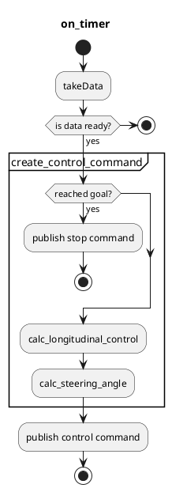

# Simple Pure Pursuit

The `simple_pure_pursuit` node receives a reference trajectory from `motion_velocity_smoother` and calculates the control command using the pure pursuit algorithm.

## Flowchart

## Input topics

| Name                 | Type                                      | Description          |
| :------------------- | :---------------------------------------- | :------------------- |
| `~/input/odometry`   | `nav_msgs::msg::Odometry`                 | ego odometry         |
| `~/input/trajectory` | `autoware_planning_msgs::msg::Trajectory` | reference trajectory |

## Output topics

| Name                       | Type                                  | Description     | QoS Durability |
| :------------------------- | :------------------------------------ | :-------------- | :------------- |
| `~/output/control_command` | `autoware_control_msgs::msg::Control` | control command | `volatile`     |

## Parameters

{{ json_to_markdown("control/autoware_simple_pure_pursuit/schema/simple_pure_pursuit.schema.json") }}
